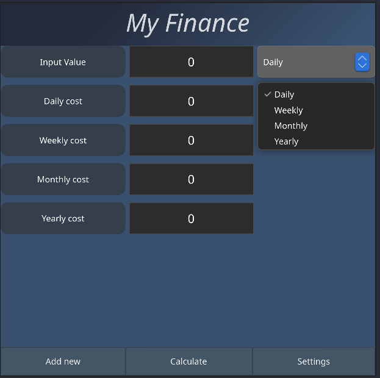
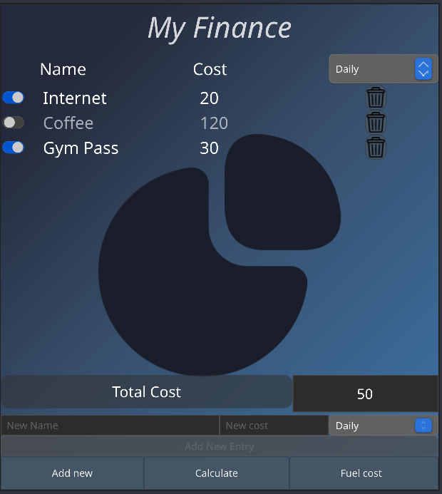
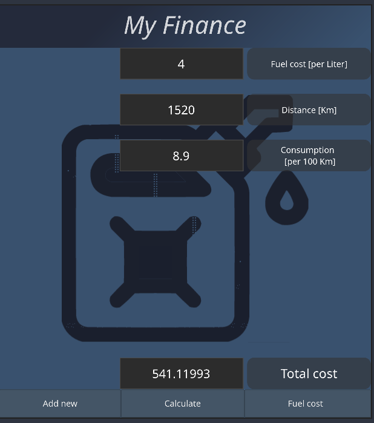

# My Finance App

Rust application that's using [Slint](https://slint.rs/) for Finance Management App.
 
### Try it yourself => [Online simulation](https://qubi0-0.github.io/My-Finance/)

## About

I want to make an app, which allows you to calculate your expenses, including onetime purchases and monthly payments. 

## How to build

1. Install Rust by following its [getting-started guide](https://www.rust-lang.org/learn/get-started).
   Once this is done, you should have the `rustc` compiler and the `cargo` build system installed in your `PATH`. 
2. Build with `cargo`:
    ```
    cargo build
    ```
3. To build the application binary:
    ```
    cargo build --release
    ```
### MacOS
First you need to install cargo bundle
```
cargo install cargo-bundle        
```
and then you can build it
```
 cargo bundle --release       
 ```
 <!-- ### Windows
`mingw-w64` (needed if crossbuild)
```
cargo build --target x86_64-pc-windows-gnu --release
``` -->

# Visualization

## Calculate Tab
Allows to quickly check how much does something cost you depending how often you spend specific amount of money.



## Add New Tab
Allows to add new expenses to see total cost (in future there will be (daily,monthly and ect) functionalities added)



## Fuel Cost Tab 
Allows to quickly estimate fuel cost for your trip

